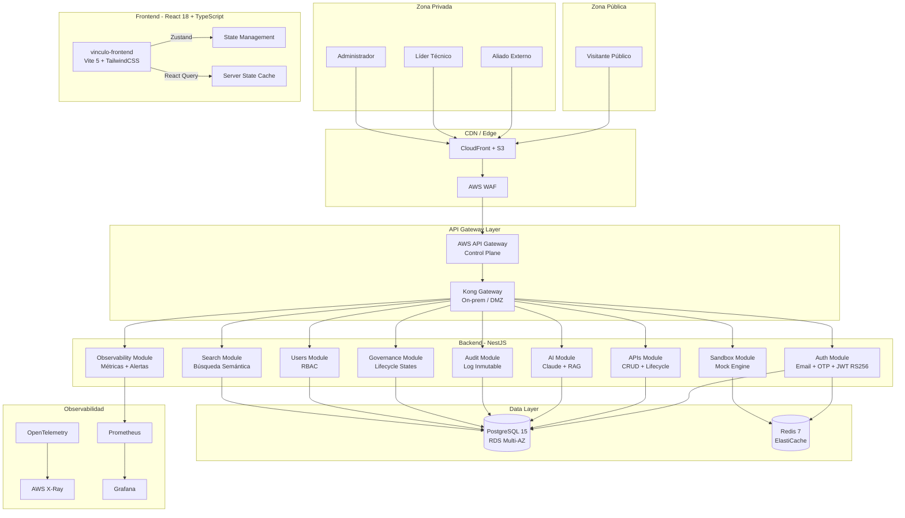
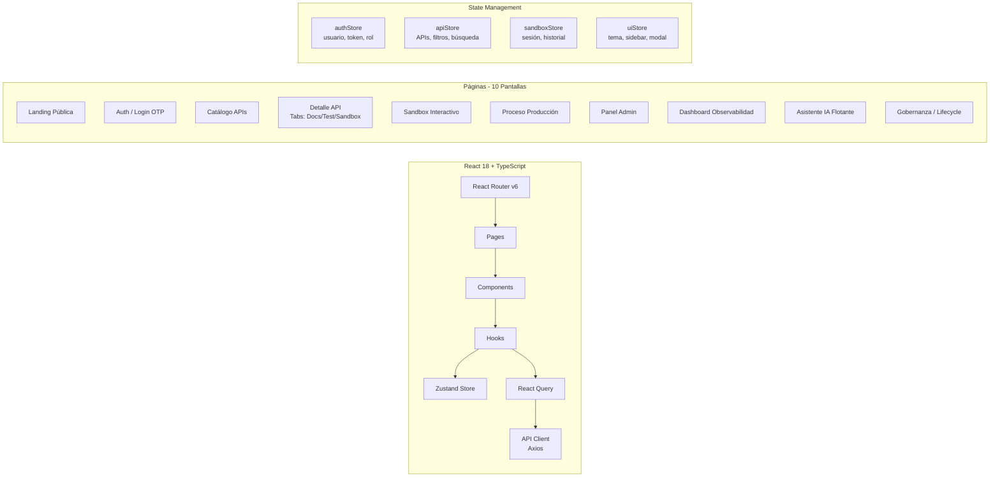
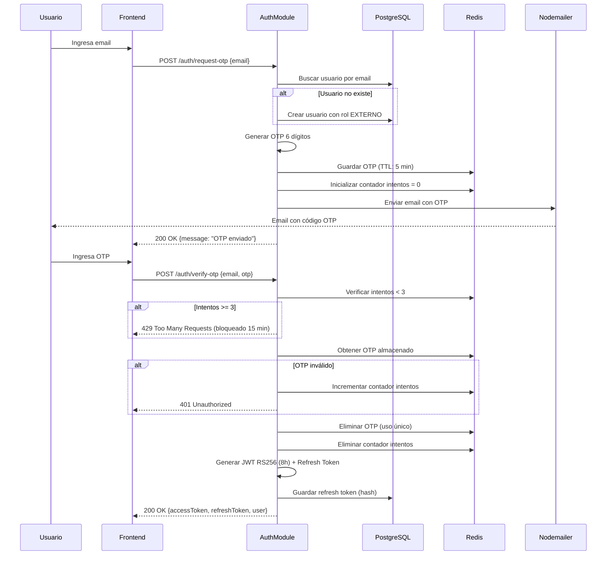
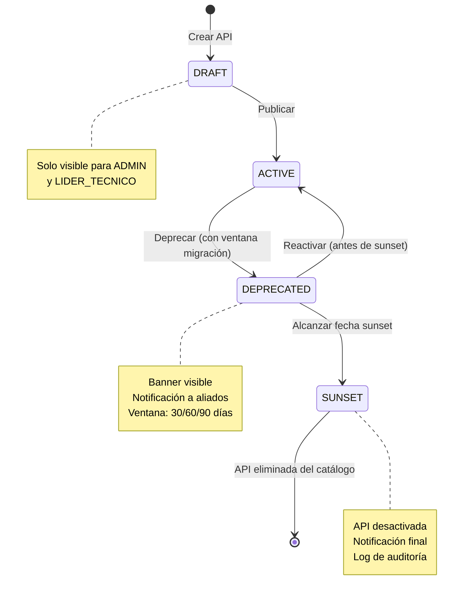
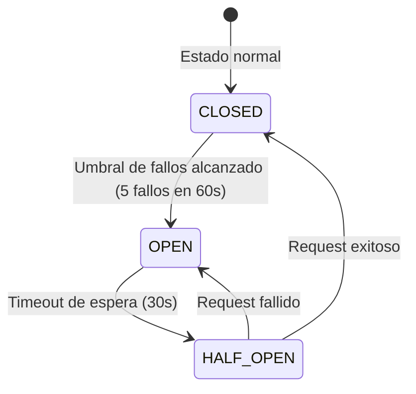

# Documento de Diseño — VÍNCULO Developer Portal

## Visión General

VÍNCULO Developer Portal es una plataforma web empresarial de autoservicio que permite a aliados externos (fintechs, intermediarios, socios digitales) explorar, probar e integrar APIs de seguros del ecosistema OpenX de Seguros Bolívar. El sistema se compone de un frontend React 18 + TypeScript, un backend NestJS con Prisma ORM sobre PostgreSQL 15, caché Redis 7, un gateway API dual (AWS API Gateway + Kong on-prem), y un módulo de IA basado en Claude claude-sonnet-4-20250514 para generación automática de documentación y asistencia contextual.

### Objetivos Arquitectónicos

- **Autoservicio completo**: Onboarding de aliados en menos de 5 minutos (Golden Path)
- **Seguridad empresarial**: OWASP API Security Top 10, mTLS, JWT RS256, RBAC de 4 niveles
- **Observabilidad nativa**: OpenTelemetry → X-Ray, Prometheus + Grafana, trazabilidad distribuida
- **IA integrada**: Generación automática de documentación OpenAPI 3.1 y asistente contextual RAG
- **Ciclo de vida gestionado**: Máquina de estados ACTIVE → DEPRECATED → SUNSET con notificaciones automáticas
- **Cumplimiento regulatorio**: SFC Colombia, Habeas Data, GDPR, auditoría inmutable

### Diagrama de Arquitectura de Alto Nivel



## Arquitectura

### Separación en 3 Capas

Siguiendo las reglas de arquitectura de Seguros Bolívar, el sistema se estructura en tres capas independientes:

1. **Capa de Presentación (Frontend)**: React 18 + TypeScript. No contiene lógica de negocio. Toda comunicación con el backend es vía API REST.
2. **Capa de Lógica (Backend)**: NestJS con módulos independientes por dominio. Reglas de negocio, validaciones, RBAC y orquestación de servicios.
3. **Capa de Persistencia (Datos)**: PostgreSQL 15 vía Prisma ORM. Redis 7 para caché de sesiones, OTPs y rate limiting.

### Arquitectura Frontend



**Estructura de rutas:**

| Ruta | Página | Acceso |
|------|--------|--------|
| `/` | Landing | PUBLICO |
| `/auth` | Login / Registro OTP | PUBLICO |
| `/catalog` | Catálogo APIs | PUBLICO (lectura), EXTERNO+ (interacción) |
| `/catalog/:apiId` | Detalle API | PUBLICO (lectura), EXTERNO+ (sandbox) |
| `/sandbox/:apiId` | Sandbox Interactivo | PUBLICO (demo), EXTERNO+ (completo) |
| `/production/:apiId` | Proceso Producción | EXTERNO+ |
| `/admin` | Panel Admin | ADMIN |
| `/admin/users` | Gestión Usuarios | ADMIN |
| `/observability` | Dashboard Métricas | LIDER_TECNICO, ADMIN |
| `/governance` | Gobernanza APIs | LIDER_TECNICO, ADMIN |

### Arquitectura Backend — Módulos NestJS

```mermaid
graph TB
    subgraph "AppModule"
        direction TB
        MAIN[main.ts<br/>Bootstrap + CORS + Swagger]

        subgraph "Core Modules"
            PRISMA[PrismaModule<br/>@Global]
            REDIS[RedisModule<br/>@Global]
            MAILER[MailerModule<br/>Nodemailer]
        end

        subgraph "Feature Modules"
            AUTH_M[AuthModule<br/>OTP + JWT + RBAC Guards]
            USERS_M[UsersModule<br/>CRUD + Roles]
            APIS_M[ApisModule<br/>CRUD + Versioning]
            SANDBOX_M[SandboxModule<br/>Mock Engine]
            AI_M[AIModule<br/>Claude + RAG]
            SEARCH_M[SearchModule<br/>Semántica + Historial]
            OBS_M[ObservabilityModule<br/>Métricas + Alertas]
            GOV_M[GovernanceModule<br/>Lifecycle FSM]
            AUDIT_M[AuditModule<br/>Log Inmutable]
            NOTIF_M[NotificationsModule<br/>Email + In-App]
        end
    end
```

### Flujo de Autenticación Email + OTP



### Máquina de Estados — Ciclo de Vida de APIs




## Componentes e Interfaces

### Módulo Auth — Autenticación Email + OTP

**Controlador:** `AuthController`

| Endpoint | Método | Descripción | Acceso |
|----------|--------|-------------|--------|
| `/auth/request-otp` | POST | Solicitar OTP por email | PUBLICO |
| `/auth/verify-otp` | POST | Verificar OTP y obtener JWT | PUBLICO |
| `/auth/refresh` | POST | Refrescar token JWT | Autenticado |
| `/auth/logout` | POST | Invalidar refresh token | Autenticado |
| `/auth/me` | GET | Obtener perfil del usuario actual | Autenticado |

**Servicio:** `AuthService`
- `requestOtp(email: string)`: Genera OTP de 6 dígitos, lo almacena en Redis con TTL de 5 minutos, envía email vía Nodemailer. Si el usuario no existe, lo crea con rol EXTERNO.
- `verifyOtp(email: string, otp: string)`: Verifica OTP contra Redis, valida intentos (máx. 3), genera JWT RS256 (8h) + refresh token rotativo.
- `refreshToken(refreshToken: string)`: Valida refresh token, genera nuevo par JWT + refresh token, invalida el anterior.
- `logout(userId: string)`: Invalida todos los refresh tokens del usuario.

**Guards:**
- `JwtAuthGuard`: Valida JWT RS256 en cada request protegido.
- `RolesGuard`: Valida que el rol del usuario permita acceso al endpoint.
- `@Roles(Role.ADMIN, Role.LIDER_TECNICO)`: Decorador para restringir endpoints por rol.

### Módulo APIs — CRUD y Versionamiento

**Controlador:** `ApisController`

| Endpoint | Método | Descripción | Acceso |
|----------|--------|-------------|--------|
| `/apis` | GET | Listar APIs con filtros | PUBLICO (básico), EXTERNO+ (completo) |
| `/apis/:id` | GET | Detalle de API | PUBLICO (básico), EXTERNO+ (completo) |
| `/apis` | POST | Crear nueva API | ADMIN |
| `/apis/:id` | PATCH | Actualizar API | ADMIN, LIDER_TECNICO |
| `/apis/:id/versions` | GET | Listar versiones | EXTERNO+ |
| `/apis/:id/versions` | POST | Crear nueva versión | ADMIN |
| `/apis/:id/upload-spec` | POST | Subir especificación OpenAPI | ADMIN |
| `/apis/:id/generate-docs` | POST | Generar docs con IA | ADMIN |

**Servicio:** `ApisService`
- `findAll(filters: ApiFilterDto)`: Búsqueda con filtros por producto, proceso, versión, estado. Paginación cursor-based.
- `findById(id: string)`: Detalle completo con especificación OpenAPI, versiones y métricas.
- `create(dto: CreateApiDto)`: Crea API en estado DRAFT. Registra en audit log.
- `uploadSpec(id: string, file: Buffer)`: Parsea especificación OpenAPI 3.1, valida estructura, almacena.
- `generateDocs(id: string, requestBody: object)`: Invoca Claude claude-sonnet-4-20250514 para auto-generar documentación OpenAPI 3.1 completa.

### Módulo Sandbox — Motor de Ejecución

**Controlador:** `SandboxController`

| Endpoint | Método | Descripción | Acceso |
|----------|--------|-------------|--------|
| `/sandbox/execute` | POST | Ejecutar llamada sandbox | PUBLICO (demo), EXTERNO+ (completo) |
| `/sandbox/history` | GET | Historial de ejecuciones | EXTERNO+ |
| `/sandbox/history/:id` | GET | Detalle de ejecución | EXTERNO+ |
| `/sandbox/presets/:apiId` | GET | Presets de prueba por API | PUBLICO |

**Servicio:** `SandboxService`
- `execute(dto: ExecuteSandboxDto, userId?: string)`: Ejecuta llamada mock con trace ID, registra request/response completo, simula latencia realista.
- `getHistory(userId: string, filters: HistoryFilterDto)`: Historial paginado de ejecuciones del aliado.

**MockEngineService:**
- `generateResponse(apiId: string, endpoint: string, body: object)`: Genera respuestas realistas de seguros (cotizaciones, pólizas, siniestros) con datos mock contextuales.
- `simulateError(scenario: ErrorScenario)`: Simula circuit breaker, timeouts, errores HTTP.

### Módulo AI — Claude + RAG

**Controlador:** `AIController`

| Endpoint | Método | Descripción | Acceso |
|----------|--------|-------------|--------|
| `/ai/generate-docs` | POST | Generar documentación desde JSON | ADMIN |
| `/ai/assistant` | POST | Consulta al asistente contextual | Autenticado |
| `/ai/assistant/public` | POST | Consulta pública al asistente | PUBLICO |
| `/ai/suggest-apis` | POST | Sugerir APIs por caso de uso | Autenticado |
| `/ai/generate-snippet` | POST | Generar snippet de código | Autenticado |

**Servicio:** `AIService`
- `generateDocs(requestBody: object)`: Invoca Claude claude-sonnet-4-20250514 con prompt estructurado para generar especificación OpenAPI 3.1 completa, casos de prueba y snippets.
- `askAssistant(query: string, context: AssistantContext)`: Pipeline RAG: embedding de la consulta → búsqueda vectorial en documentación → prompt con contexto → respuesta de Claude.
- `suggestApis(businessNeed: string)`: Interpreta necesidad de negocio y retorna APIs relevantes del catálogo.
- `generateSnippet(apiId: string, endpoint: string, language: CodeLanguage)`: Genera snippet funcional en JS, Python, Java o cURL.

### Módulo Search — Búsqueda Semántica

**Controlador:** `SearchController`

| Endpoint | Método | Descripción | Acceso |
|----------|--------|-------------|--------|
| `/search` | GET | Búsqueda global | PUBLICO |
| `/search/semantic` | POST | Búsqueda semántica con IA | Autenticado |
| `/search/history` | GET | Historial de búsquedas | Autenticado |
| `/search/suggestions` | GET | Sugerencias de autocompletado | PUBLICO |

**Servicio:** `SearchService`
- `search(query: string, filters: SearchFilterDto)`: Búsqueda full-text en PostgreSQL con `ts_vector` + `ts_query`. Retorna en < 500ms.
- `semanticSearch(query: string)`: Interpreta intención con Claude, busca por embeddings, retorna APIs relevantes.
- `saveHistory(userId: string, query: string)`: Guarda búsqueda en historial del usuario.

### Módulo Observability — Métricas y Alertas

**Controlador:** `ObservabilityController`

| Endpoint | Método | Descripción | Acceso |
|----------|--------|-------------|--------|
| `/observability/metrics` | GET | Métricas generales | LIDER_TECNICO, ADMIN |
| `/observability/metrics/:apiId` | GET | Métricas por API | LIDER_TECNICO, ADMIN |
| `/observability/latency/:apiId` | GET | Percentiles de latencia | LIDER_TECNICO, ADMIN |
| `/observability/alerts` | GET | Alertas activas | LIDER_TECNICO, ADMIN |
| `/observability/export` | POST | Exportar CSV | LIDER_TECNICO, ADMIN |
| `/observability/traces/:traceId` | GET | Detalle de trace | LIDER_TECNICO, ADMIN |

### Módulo Governance — Ciclo de Vida

**Controlador:** `GovernanceController`

| Endpoint | Método | Descripción | Acceso |
|----------|--------|-------------|--------|
| `/governance/apis/:id/publish` | POST | Publicar API (DRAFT → ACTIVE) | ADMIN |
| `/governance/apis/:id/deprecate` | POST | Deprecar API | ADMIN |
| `/governance/apis/:id/sunset` | POST | Sunset de API | ADMIN |
| `/governance/apis/:id/reactivate` | POST | Reactivar API deprecada | ADMIN |
| `/governance/apis/:id/timeline` | GET | Timeline de cambios | LIDER_TECNICO, ADMIN |
| `/governance/status` | GET | Panel de estado global | LIDER_TECNICO, ADMIN |

**Servicio:** `GovernanceService`
- `publish(apiId: string)`: Transición DRAFT → ACTIVE. Registra en audit log.
- `deprecate(apiId: string, dto: DeprecateDto)`: Transición ACTIVE → DEPRECATED. Configura ventana de migración (30/60/90 días). Notifica aliados consumidores. Registra en audit log.
- `sunset(apiId: string)`: Transición DEPRECATED → SUNSET. Desactiva API del catálogo. Notifica aliados. Registra en audit log.
- `reactivate(apiId: string)`: Transición DEPRECATED → ACTIVE (solo antes de fecha sunset). Registra en audit log.
- `validateTransition(currentState: ApiLifecycleState, targetState: ApiLifecycleState)`: Valida que la transición sea permitida según la máquina de estados.

### Módulo Audit — Log Inmutable

**Controlador:** `AuditController`

| Endpoint | Método | Descripción | Acceso |
|----------|--------|-------------|--------|
| `/audit/logs` | GET | Consultar logs con filtros | ADMIN |
| `/audit/logs/:id` | GET | Detalle de log | ADMIN |
| `/audit/compliance` | GET | Reporte de cumplimiento | ADMIN |

**Servicio:** `AuditService`
- `log(entry: AuditLogEntry)`: Crea registro inmutable en PostgreSQL. Campos: userId, action, resource, resourceId, metadata (JSON), ipAddress, timestamp.
- `findAll(filters: AuditFilterDto)`: Consulta con filtros por usuario, acción, recurso, rango de fechas. Paginación cursor-based.
- `generateComplianceReport(dateRange: DateRange)`: Genera reporte de cumplimiento SFC/Habeas Data/GDPR.

**Inmutabilidad**: La tabla `audit_logs` se protege con:
- Trigger PostgreSQL que previene UPDATE y DELETE
- Política de retención mínima de 1 año
- Índices en `userId`, `action`, `createdAt` para consultas eficientes

### Módulo Users — Gestión y RBAC

**Controlador:** `UsersController`

| Endpoint | Método | Descripción | Acceso |
|----------|--------|-------------|--------|
| `/users` | GET | Listar usuarios | ADMIN |
| `/users/:id` | GET | Detalle de usuario | ADMIN |
| `/users/:id/role` | PATCH | Cambiar rol | ADMIN |
| `/users/:id/status` | PATCH | Activar/Desactivar | ADMIN |

### Módulo Notifications — Notificaciones

**Controlador:** `NotificationsController`

| Endpoint | Método | Descripción | Acceso |
|----------|--------|-------------|--------|
| `/notifications` | GET | Listar notificaciones del usuario | Autenticado |
| `/notifications/:id/read` | PATCH | Marcar como leída | Autenticado |
| `/notifications/read-all` | PATCH | Marcar todas como leídas | Autenticado |

### Módulo OpenAPI Parser/Printer

**Servicio:** `OpenApiParserService`
- `parse(spec: string | Buffer): ApiSpecObject`: Parsea especificación OpenAPI 3.1 (YAML/JSON) en objeto estructurado. Valida contra el esquema OpenAPI 3.1. Retorna errores descriptivos con ubicación del problema.
- `print(specObject: ApiSpecObject): string`: Serializa objeto de especificación API de vuelta a formato OpenAPI 3.1 válido (YAML o JSON).
- `validate(spec: string | Buffer): ValidationResult`: Valida especificación sin parsear completamente. Retorna lista de errores con línea y columna.
- `roundTrip(spec: string): boolean`: Verifica que parse(print(parse(spec))) === parse(spec) para garantizar integridad.


## Modelos de Datos

### Esquema Prisma — PostgreSQL 15

```prisma
// prisma/schema.prisma

generator client {
  provider = "prisma-client-js"
}

datasource db {
  provider = "postgresql"
  url      = env("DATABASE_URL")
}

// ─── Enums ───────────────────────────────────────────────

enum UserRole {
  PUBLICO
  EXTERNO
  LIDER_TECNICO
  ADMIN
}

enum UserStatus {
  ACTIVE
  BLOCKED
  INACTIVE
}

enum ApiLifecycleState {
  DRAFT
  ACTIVE
  DEPRECATED
  SUNSET
}

enum ApiProduct {
  VIDA
  AUTO
  HOGAR
  SALUD
  OPEN_FINANCE
  IDENTITY_SECURITY
}

enum ApiProcess {
  COTIZACION
  EMISION
  POLIZA
  RENOVACION
  SINIESTRO
  VALIDACION
  BRIDGE
  SCORING
  PAGOS
  AUTH
  KYC
}

enum AuditAction {
  USER_CREATED
  USER_ROLE_CHANGED
  USER_STATUS_CHANGED
  API_CREATED
  API_UPDATED
  API_PUBLISHED
  API_DEPRECATED
  API_SUNSET
  API_REACTIVATED
  API_SPEC_UPLOADED
  API_DOCS_GENERATED
  SANDBOX_EXECUTED
  LOGIN_SUCCESS
  LOGIN_FAILED
  LOGOUT
}

enum NotificationType {
  API_DEPRECATED
  API_SUNSET
  QUOTA_WARNING
  SYSTEM_ANNOUNCEMENT
  WELCOME
}

enum MigrationWindow {
  DAYS_30
  DAYS_60
  DAYS_90
}

// ─── Modelos ─────────────────────────────────────────────

model User {
  id            String       @id @default(uuid())
  email         String       @unique
  name          String?
  company       String?
  role          UserRole     @default(EXTERNO)
  status        UserStatus   @default(ACTIVE)
  lastLoginAt   DateTime?
  createdAt     DateTime     @default(now())
  updatedAt     DateTime     @updatedAt

  // Relaciones
  refreshTokens RefreshToken[]
  sandboxSessions SandboxSession[]
  searchHistory SearchHistory[]
  notifications Notification[]
  auditLogs     AuditLog[]    @relation("AuditUser")
  apiConsumptions ApiConsumption[]

  @@index([email])
  @@index([role])
  @@index([status])
  @@map("users")
}

model RefreshToken {
  id          String   @id @default(uuid())
  tokenHash   String   @unique
  userId      String
  expiresAt   DateTime
  createdAt   DateTime @default(now())

  user User @relation(fields: [userId], references: [id], onDelete: Cascade)

  @@index([userId])
  @@index([expiresAt])
  @@map("refresh_tokens")
}

model Api {
  id            String            @id @default(uuid())
  name          String
  slug          String            @unique
  description   String
  descriptionEn String?           @map("description_en")
  product       ApiProduct
  process       ApiProcess
  currentVersion String           @default("1.0.0")
  lifecycleState ApiLifecycleState @default(DRAFT)
  deprecatedAt  DateTime?
  sunsetAt      DateTime?
  migrationWindow MigrationWindow?
  slaUptime     Float?            @default(99.9)
  specOpenApi   Json?             @map("spec_openapi")
  testCases     Json?             @map("test_cases")
  sandboxConfig Json?             @map("sandbox_config")
  codeSnippets  Json?             @map("code_snippets")
  contactName   String?           @map("contact_name")
  contactEmail  String?           @map("contact_email")
  contactSlack  String?           @map("contact_slack")
  createdAt     DateTime          @default(now())
  updatedAt     DateTime          @updatedAt

  // Relaciones
  versions      ApiVersion[]
  sandboxSessions SandboxSession[]
  consumptions  ApiConsumption[]

  @@index([product])
  @@index([process])
  @@index([lifecycleState])
  @@index([slug])
  @@map("apis")
}

model ApiVersion {
  id            String            @id @default(uuid())
  apiId         String
  version       String
  versionUrl    String            @map("version_url")
  lifecycleState ApiLifecycleState @default(ACTIVE)
  specOpenApi   Json?             @map("spec_openapi")
  changelog     String?
  publishedAt   DateTime          @default(now())
  deprecatedAt  DateTime?
  sunsetAt      DateTime?
  createdAt     DateTime          @default(now())

  api Api @relation(fields: [apiId], references: [id], onDelete: Cascade)

  @@unique([apiId, version])
  @@index([apiId])
  @@index([lifecycleState])
  @@map("api_versions")
}

model ApiConsumption {
  id        String   @id @default(uuid())
  userId    String
  apiId     String
  callCount Int      @default(0)
  quota     Int      @default(1000)
  period    String   @default("monthly")
  createdAt DateTime @default(now())
  updatedAt DateTime @updatedAt

  user User @relation(fields: [userId], references: [id], onDelete: Cascade)
  api  Api  @relation(fields: [apiId], references: [id], onDelete: Cascade)

  @@unique([userId, apiId])
  @@index([userId])
  @@index([apiId])
  @@map("api_consumptions")
}

model SandboxSession {
  id          String   @id @default(uuid())
  userId      String?
  apiId       String
  endpoint    String
  method      String
  requestBody Json?    @map("request_body")
  requestHeaders Json? @map("request_headers")
  responseBody Json?   @map("response_body")
  responseStatus Int   @map("response_status")
  traceId     String   @unique @map("trace_id")
  latencyMs   Int      @map("latency_ms")
  isDemo      Boolean  @default(false) @map("is_demo")
  createdAt   DateTime @default(now())

  user User? @relation(fields: [userId], references: [id], onDelete: SetNull)
  api  Api   @relation(fields: [apiId], references: [id], onDelete: Cascade)

  @@index([userId])
  @@index([apiId])
  @@index([traceId])
  @@index([createdAt])
  @@map("sandbox_sessions")
}

model SearchHistory {
  id        String   @id @default(uuid())
  userId    String
  query     String
  filters   Json?
  resultCount Int    @default(0) @map("result_count")
  createdAt DateTime @default(now())

  user User @relation(fields: [userId], references: [id], onDelete: Cascade)

  @@index([userId])
  @@index([createdAt])
  @@map("search_history")
}

model Notification {
  id        String           @id @default(uuid())
  userId    String
  type      NotificationType
  title     String
  message   String
  metadata  Json?
  isRead    Boolean          @default(false) @map("is_read")
  createdAt DateTime         @default(now())

  user User @relation(fields: [userId], references: [id], onDelete: Cascade)

  @@index([userId])
  @@index([isRead])
  @@index([createdAt])
  @@map("notifications")
}

model AuditLog {
  id          String      @id @default(uuid())
  userId      String
  action      AuditAction
  resource    String
  resourceId  String?     @map("resource_id")
  metadata    Json?
  ipAddress   String      @map("ip_address")
  userAgent   String?     @map("user_agent")
  createdAt   DateTime    @default(now())

  user User @relation("AuditUser", fields: [userId], references: [id])

  // NO updatedAt — registro inmutable
  // Trigger PostgreSQL previene UPDATE y DELETE

  @@index([userId])
  @@index([action])
  @@index([resource])
  @@index([createdAt])
  @@map("audit_logs")
}
```

### Trigger de Inmutabilidad — Audit Logs

```sql
-- Trigger que previene UPDATE y DELETE en audit_logs
CREATE OR REPLACE FUNCTION prevent_audit_log_modification()
RETURNS TRIGGER AS $$
BEGIN
  RAISE EXCEPTION 'Los registros de auditoría son inmutables. No se permite UPDATE ni DELETE.';
  RETURN NULL;
END;
$$ LANGUAGE plpgsql;

CREATE TRIGGER audit_log_immutable_update
  BEFORE UPDATE ON audit_logs
  FOR EACH ROW
  EXECUTE FUNCTION prevent_audit_log_modification();

CREATE TRIGGER audit_log_immutable_delete
  BEFORE DELETE ON audit_logs
  FOR EACH ROW
  EXECUTE FUNCTION prevent_audit_log_modification();
```

### Esquema Redis — Caché y Sesiones

```
# OTP Storage
otp:{email}           → {code: "123456", attempts: 0}  TTL: 300s (5 min)
otp:blocked:{email}   → "1"                             TTL: 900s (15 min)

# Session Cache
session:{userId}      → {role, email, lastActivity}     TTL: 28800s (8h)

# Rate Limiting
ratelimit:{ip}:{endpoint} → counter                     TTL: 60s

# API Cache
api:catalog           → JSON serializado del catálogo    TTL: 300s (5 min)
api:detail:{apiId}    → JSON del detalle de API          TTL: 600s (10 min)

# Search Cache
search:{queryHash}    → JSON de resultados               TTL: 120s (2 min)
```


## Propiedades de Correctitud

*Una propiedad es una característica o comportamiento que debe mantenerse verdadero en todas las ejecuciones válidas de un sistema — esencialmente, una declaración formal sobre lo que el sistema debe hacer. Las propiedades sirven como puente entre especificaciones legibles por humanos y garantías de correctitud verificables por máquinas.*

### Propiedad 1: Round-Trip de Especificaciones OpenAPI

*Para toda* especificación OpenAPI 3.1 válida representada como objeto estructurado, serializar (print) y luego parsear (parse) y luego serializar nuevamente SHALL producir una salida equivalente a la primera serialización. Es decir: `print(parse(print(specObject))) === print(specObject)`.

**Valida: Requerimientos 7.1, 7.3, 7.4**

### Propiedad 2: Reporte de Errores del Parser OpenAPI

*Para toda* especificación OpenAPI 3.1 inválida (campos requeridos faltantes, tipos incorrectos, estructura malformada), el Parser_OpenAPI SHALL retornar un resultado de error que contenga al menos un mensaje descriptivo indicando la naturaleza del problema, y nunca SHALL retornar un objeto de especificación válido.

**Valida: Requerimiento 7.2**

### Propiedad 3: Matriz de Autorización RBAC

*Para todo* par (rol de usuario, endpoint), el sistema SHALL conceder acceso si y solo si el rol está en la lista de roles permitidos para ese endpoint. Específicamente: usuarios PUBLICO solo acceden a endpoints públicos, usuarios EXTERNO no acceden a administración/gobernanza/observabilidad avanzada, usuarios LIDER_TECNICO acceden a observabilidad y gobernanza pero no a administración de usuarios, y usuarios ADMIN acceden a todos los endpoints.

**Valida: Requerimientos 11.1, 11.4, 11.5**

### Propiedad 4: Formato de OTP

*Para todo* OTP generado por el Sistema_Auth, el código SHALL ser una cadena de exactamente 6 dígitos numéricos (rango 000000-999999).

**Valida: Requerimiento 2.2**

### Propiedad 5: Ciclo de Vida del OTP

*Para todo* OTP generado, (a) después de transcurridos 5 minutos desde su generación, la verificación SHALL fallar con error de expiración, y (b) después de una verificación exitosa, cualquier intento posterior de verificar el mismo OTP SHALL fallar con error de uso previo.

**Valida: Requerimientos 2.3, 2.8**

### Propiedad 6: Bloqueo por Intentos Fallidos de OTP

*Para todo* email y *para toda* secuencia de 3 OTPs incorrectos consecutivos, el Sistema_Auth SHALL bloquear la cuenta durante 15 minutos, rechazando cualquier intento de verificación adicional durante ese período.

**Valida: Requerimiento 2.4**

### Propiedad 7: Propiedades del Token JWT

*Para toda* autenticación exitosa, el JWT emitido SHALL estar firmado con algoritmo RS256, tener un claim `exp` configurado a exactamente 8 horas desde el momento de emisión, y estar acompañado de un refresh token único.

**Valida: Requerimiento 2.5**

### Propiedad 8: Auto-Registro con Rol por Defecto

*Para todo* email válido que no corresponda a un usuario existente en el sistema, al solicitar un OTP, el Sistema_Auth SHALL crear un nuevo usuario con rol EXTERNO y estado ACTIVE.

**Valida: Requerimiento 2.7**

### Propiedad 9: Completitud y Creación de Logs de Auditoría

*Para toda* acción administrativa (publicar API, deprecar API, cambiar rol de usuario, sunset de API, subir especificación), el Log_Auditoría SHALL crear un registro que contenga: userId del ejecutor, tipo de acción, recurso afectado, resourceId, marca de tiempo (createdAt) e IP de origen.

**Valida: Requerimientos 6.6, 8.4, 11.3, 13.3, 14.1**

### Propiedad 10: Inmutabilidad del Log de Auditoría

*Para todo* registro existente en el Log_Auditoría, cualquier operación de UPDATE o DELETE SHALL ser rechazada por la base de datos, preservando el registro original sin modificaciones.

**Valida: Requerimiento 14.4**

### Propiedad 11: Correctitud de Filtros del Log de Auditoría

*Para toda* combinación de filtros (usuario, tipo de acción, recurso, rango de fechas) aplicada al Log_Auditoría, todos los registros retornados SHALL cumplir con cada filtro aplicado simultáneamente.

**Valida: Requerimiento 14.3**

### Propiedad 12: Máquina de Estados del Ciclo de Vida de APIs

*Para toda* API en cualquier estado del ciclo de vida, el Sistema_Gobernanza SHALL aceptar únicamente transiciones válidas según la máquina de estados definida (DRAFT→ACTIVE, ACTIVE→DEPRECATED, DEPRECATED→SUNSET, DEPRECATED→ACTIVE) y SHALL rechazar cualquier otra transición con un error descriptivo.

**Valida: Requerimiento 13.1**

### Propiedad 13: Cobertura de Notificación por Deprecación

*Para toda* API con N aliados consumidores activos, al ejecutar la acción de deprecación, el sistema SHALL crear exactamente N notificaciones de tipo API_DEPRECATED, una por cada aliado consumidor.

**Valida: Requerimiento 8.2**

### Propiedad 14: Cálculo de Ventana de Migración

*Para toda* fecha de deprecación D y *para toda* ventana de migración W ∈ {30, 60, 90} días, la fecha de sunset calculada SHALL ser exactamente D + W días calendario.

**Valida: Requerimiento 8.3**

### Propiedad 15: Accesibilidad de APIs Deprecadas

*Para toda* API en estado DEPRECATED cuya fecha de sunset aún no ha sido alcanzada, la API SHALL seguir apareciendo en las consultas del Catálogo y el Motor_Sandbox SHALL seguir funcionando para esa API.

**Valida: Requerimiento 8.5**

### Propiedad 16: Relevancia de Búsqueda

*Para toda* API en el Catálogo y *para todo* substring del nombre de la API, al buscar por ese substring, la API SHALL aparecer en los resultados de búsqueda.

**Valida: Requerimientos 1.5, 12.1**

### Propiedad 17: Correctitud de Filtros del Catálogo

*Para toda* combinación de filtros (producto, proceso, versión, estado) aplicada al Catálogo, todos los resultados retornados SHALL cumplir con cada filtro aplicado simultáneamente, y ningún resultado que no cumpla con todos los filtros SHALL ser incluido.

**Valida: Requerimientos 3.1, 12.3**

### Propiedad 18: Persistencia del Historial de Búsqueda

*Para todo* usuario autenticado que ejecuta una búsqueda, la consulta SHALL aparecer en su historial de búsquedas recientes con el texto exacto de la consulta y la marca de tiempo.

**Valida: Requerimiento 12.5**

### Propiedad 19: Generación de Snippets de Código

*Para todo* endpoint de API con especificación OpenAPI válida, el sistema SHALL generar snippets funcionales en los 4 lenguajes soportados (JavaScript, Python, Java, cURL), y cada snippet SHALL contener la URL correcta del endpoint, el método HTTP y los headers requeridos.

**Valida: Requerimiento 3.5**

### Propiedad 20: Registro de Sesiones de Sandbox

*Para toda* ejecución en el Motor_Sandbox, el sistema SHALL persistir un registro que contenga: request body completo, response body completo, trace ID único, latencia en milisegundos, y referencia al API y endpoint ejecutados.

**Valida: Requerimiento 4.5**

### Propiedad 21: Alerta de Umbral de Cuota

*Para todo* aliado con cuota Q y consumo actual C, cuando C ≥ 0.8 × Q, el sistema SHALL generar una alerta de tipo QUOTA_WARNING. Cuando C < 0.8 × Q, no SHALL generarse alerta.

**Valida: Requerimiento 10.3**

### Propiedad 22: Cálculo de Percentiles de Latencia

*Para todo* conjunto de valores de latencia de un API, los percentiles p50, p95 y p99 SHALL ser calculados correctamente según la fórmula estándar de percentiles, donde p50 es la mediana, p95 es el valor por debajo del cual cae el 95% de las observaciones, y p99 es el valor por debajo del cual cae el 99%.

**Valida: Requerimiento 10.2**


## Manejo de Errores

### Estrategia General

El sistema implementa un manejo de errores estructurado en todas las capas, siguiendo las reglas de arquitectura de Seguros Bolívar (retries, circuit breakers, graceful shutdown).

### Formato de Error Estándar

Todas las respuestas de error siguen un formato JSON consistente:

```json
{
  "statusCode": 400,
  "error": "Bad Request",
  "message": "Descripción legible del error",
  "details": [
    {
      "field": "email",
      "constraint": "isEmail",
      "message": "El email proporcionado no es válido"
    }
  ],
  "traceId": "abc-123-def-456",
  "timestamp": "2026-01-15T10:30:00.000Z"
}
```

### Errores por Módulo

#### Auth Module
| Código | Escenario | Respuesta |
|--------|-----------|-----------|
| 400 | Email inválido | Formato de email no válido |
| 401 | OTP incorrecto | Código OTP inválido. Intentos restantes: N |
| 401 | OTP expirado | El código OTP ha expirado. Solicite uno nuevo |
| 429 | Cuenta bloqueada (3 intentos) | Cuenta bloqueada por 15 minutos |
| 401 | JWT expirado | Token de sesión expirado |
| 401 | Refresh token inválido | Refresh token inválido o expirado |

#### APIs Module
| Código | Escenario | Respuesta |
|--------|-----------|-----------|
| 400 | Especificación OpenAPI inválida | Error de validación con ubicación del problema |
| 404 | API no encontrada | API con ID {id} no encontrada |
| 409 | Versión duplicada | La versión {version} ya existe para esta API |
| 422 | JSON de request body inválido para IA | El JSON proporcionado no es un request body válido |

#### Governance Module
| Código | Escenario | Respuesta |
|--------|-----------|-----------|
| 400 | Transición de estado inválida | No se puede transicionar de {current} a {target} |
| 400 | Ventana de migración inválida | La ventana de migración debe ser 30, 60 o 90 días |
| 409 | API ya en estado objetivo | La API ya se encuentra en estado {state} |

#### Sandbox Module
| Código | Escenario | Respuesta |
|--------|-----------|-----------|
| 400 | Request body malformado | El request body no es JSON válido |
| 404 | Endpoint no encontrado en API | El endpoint {path} no existe en la API {apiId} |
| 503 | Circuit breaker activado (simulado) | Servicio temporalmente no disponible (simulación) |
| 504 | Timeout (simulado) | Timeout de conexión (simulación) |

#### Search Module
| Código | Escenario | Respuesta |
|--------|-----------|-----------|
| 400 | Query vacío | El término de búsqueda no puede estar vacío |
| 400 | Query demasiado largo | El término de búsqueda no puede exceder 200 caracteres |

#### Audit Module
| Código | Escenario | Respuesta |
|--------|-----------|-----------|
| 400 | Rango de fechas inválido | La fecha de inicio debe ser anterior a la fecha de fin |
| 403 | Intento de modificar log | Los registros de auditoría son inmutables |

### Circuit Breaker y Retries



**Configuración:**
- **Retries**: Máximo 3 intentos con backoff exponencial (1s, 2s, 4s) para llamadas a servicios externos
- **Circuit Breaker**: Se abre después de 5 fallos consecutivos en 60 segundos. Timeout de recuperación: 30 segundos
- **Timeouts**: 15 segundos máximo para operaciones de backend (regla de arquitectura SB)

### Validación de Entrada

Toda entrada del usuario se valida con `class-validator` + `class-transformer` en NestJS:

```typescript
// Ejemplo: DTO de verificación OTP
export class VerifyOtpDto {
  @IsEmail({}, { message: 'El email proporcionado no es válido' })
  email: string;

  @IsString()
  @Length(6, 6, { message: 'El OTP debe ser exactamente 6 dígitos' })
  @Matches(/^\d{6}$/, { message: 'El OTP debe contener solo dígitos' })
  otp: string;
}
```

**Configuración global de ValidationPipe:**
```typescript
app.useGlobalPipes(new ValidationPipe({
  whitelist: true,
  forbidNonWhitelisted: true,
  transform: true,
  transformOptions: { enableImplicitConversion: false },
}));
```

## Estrategia de Testing

### Enfoque Dual: Tests Unitarios + Tests Basados en Propiedades

El proyecto utiliza un enfoque dual de testing que combina tests unitarios (ejemplos específicos) con tests basados en propiedades (verificación universal) para lograr cobertura comprehensiva.

### Stack de Testing

| Capa | Herramienta | Propósito |
|------|-------------|-----------|
| Backend Unit | Jest + Supertest | Tests unitarios y de integración de módulos NestJS |
| Backend PBT | fast-check (con Jest) | Tests basados en propiedades para lógica de negocio |
| Frontend Unit | Vitest + Testing Library | Tests de componentes React |
| Frontend PBT | fast-check (con Vitest) | Tests basados en propiedades para lógica frontend |
| E2E | Playwright | Tests end-to-end de flujos completos |
| Quality Gate | SonarQube | Cobertura mínima > 80% |

### Librería de Property-Based Testing: fast-check

Se utiliza [fast-check](https://github.com/dubzzz/fast-check) como librería de PBT para TypeScript/JavaScript. Cada test basado en propiedades se configura con un mínimo de 100 iteraciones.

### Mapeo de Propiedades a Tests

Cada propiedad de correctitud del diseño se implementa como un test basado en propiedades con el siguiente formato de tag:

```typescript
// Feature: vinculo-developer-portal, Property 1: Round-Trip de Especificaciones OpenAPI
it('should preserve OpenAPI spec through parse-print-parse round trip', () => {
  fc.assert(
    fc.property(validOpenApiSpecArb, (spec) => {
      const printed = printer.print(spec);
      const parsed = parser.parse(printed);
      const reprinted = printer.print(parsed);
      expect(reprinted).toEqual(printed);
    }),
    { numRuns: 100 }
  );
});
```

### Tests Unitarios (Ejemplos Específicos)

Los tests unitarios cubren escenarios específicos, edge cases y puntos de integración:

**Auth Module:**
- Flujo completo de registro con email nuevo
- Flujo de login con email existente
- Refresco silencioso de token
- Logout e invalidación de refresh tokens

**APIs Module:**
- CRUD completo de APIs
- Upload de especificación OpenAPI válida e inválida
- Generación de documentación con IA (mock de Claude API)

**Sandbox Module:**
- Ejecución en modo demo (sin auth)
- Ejecución autenticada con datos personalizados
- Simulación de escenarios de error (circuit breaker, timeout)

**Governance Module:**
- Publicación de API (DRAFT → ACTIVE)
- Deprecación con ventana de migración
- Sunset y desactivación del catálogo
- Reactivación de API deprecada

**Audit Module:**
- Creación de registro de auditoría
- Consulta con filtros combinados
- Verificación de inmutabilidad (UPDATE/DELETE rechazados)

**Search Module:**
- Búsqueda por nombre exacto y parcial
- Búsqueda con filtros combinados
- Historial de búsquedas

### Tests Basados en Propiedades (PBT)

Cada propiedad del diseño se implementa como un test PBT con fast-check:

| Propiedad | Módulo | Generadores |
|-----------|--------|-------------|
| P1: Round-Trip OpenAPI | OpenAPI Parser | `validOpenApiSpecArb`: genera specs OpenAPI 3.1 válidas con paths, schemas, responses aleatorios |
| P2: Error Reporting Parser | OpenAPI Parser | `invalidOpenApiSpecArb`: genera specs con campos faltantes, tipos incorrectos, estructura malformada |
| P3: RBAC Matrix | Auth Guards | `userRoleArb × endpointArb`: genera pares (rol, endpoint) y verifica acceso |
| P4: Formato OTP | Auth Service | `fc.integer({min: 1, max: 10000})`: genera N OTPs y verifica formato 6 dígitos |
| P5: Ciclo de Vida OTP | Auth Service | `emailArb × otpArb × delayArb`: genera OTPs con diferentes delays y verifica expiración/uso único |
| P6: Bloqueo OTP | Auth Service | `emailArb × fc.array(wrongOtpArb, {minLength: 3, maxLength: 3})`: genera secuencias de 3 OTPs incorrectos |
| P7: JWT Properties | Auth Service | `userArb`: genera usuarios aleatorios, verifica JWT RS256 con exp=8h |
| P8: Auto-Registro | Auth Service | `newEmailArb`: genera emails no existentes, verifica creación con rol EXTERNO |
| P9: Audit Log Completeness | Audit Service | `adminActionArb`: genera acciones administrativas, verifica campos requeridos |
| P10: Audit Immutability | Audit Service | `auditLogArb × updateArb`: genera logs y operaciones UPDATE/DELETE, verifica rechazo |
| P11: Audit Filter Correctness | Audit Service | `auditFilterArb × auditLogSetArb`: genera filtros y conjuntos de logs, verifica correctitud |
| P12: State Machine | Governance Service | `apiStateArb × targetStateArb`: genera pares (estado actual, estado objetivo), verifica transiciones válidas/inválidas |
| P13: Deprecation Notifications | Governance Service | `apiArb × consumersArb`: genera APIs con N consumidores, verifica N notificaciones |
| P14: Migration Window | Governance Service | `dateArb × migrationWindowArb`: genera fechas y ventanas, verifica cálculo de sunset |
| P15: Deprecated Accessibility | Governance Service | `deprecatedApiArb`: genera APIs deprecadas con sunset futuro, verifica accesibilidad |
| P16: Search Relevance | Search Service | `apiNameArb × substringArb`: genera APIs y substrings de sus nombres, verifica aparición en resultados |
| P17: Catalog Filter Correctness | Search Service | `catalogFilterArb × apiSetArb`: genera filtros y conjuntos de APIs, verifica correctitud |
| P18: Search History | Search Service | `userArb × queryArb`: genera búsquedas, verifica persistencia en historial |
| P19: Code Snippets | APIs Service | `endpointSpecArb × languageArb`: genera specs de endpoints, verifica snippets en 4 lenguajes |
| P20: Sandbox Recording | Sandbox Service | `sandboxRequestArb`: genera requests de sandbox, verifica registro completo con trace ID |
| P21: Quota Alert | Observability Service | `quotaArb × consumptionArb`: genera cuotas y consumos, verifica alerta en umbral 80% |
| P22: Percentile Calculation | Observability Service | `fc.array(fc.nat({max: 10000}), {minLength: 10})`: genera arrays de latencias, verifica p50/p95/p99 |

### Tests E2E (Playwright)

Flujos end-to-end que validan la experiencia completa del usuario:

1. **Golden Path**: Visitante → Registro → OTP → Login → Catálogo → Sandbox → Primera llamada API
2. **Flujo Admin**: Login Admin → Subir API → Generar docs IA → Preview → Publicar
3. **Deprecación**: Login Admin → Seleccionar API → Deprecar → Verificar banner → Verificar notificaciones
4. **Búsqueda**: Landing → Buscar API → Filtrar → Ver detalle → Probar en sandbox
5. **Observabilidad**: Login Líder Técnico → Dashboard → Métricas → Exportar CSV

### Configuración de Quality Gate

```yaml
# SonarQube Quality Gate
sonar.qualitygate:
  coverage: 80%        # Cobertura mínima de código
  duplications: 3%     # Máximo de código duplicado
  maintainability: A   # Rating de mantenibilidad
  reliability: A       # Rating de confiabilidad
  security: A          # Rating de seguridad
```

### Estructura de Archivos de Test

```
vinculo-backend/
├── src/
│   ├── auth/
│   │   ├── __tests__/
│   │   │   ├── auth.service.spec.ts          # Unit tests
│   │   │   ├── auth.service.property.spec.ts # PBT: P4, P5, P6, P7, P8
│   │   │   └── auth.controller.spec.ts       # Integration tests
│   │   └── ...
│   ├── apis/
│   │   ├── __tests__/
│   │   │   ├── openapi-parser.property.spec.ts # PBT: P1, P2
│   │   │   ├── apis.service.spec.ts            # Unit tests
│   │   │   └── snippet-generator.property.spec.ts # PBT: P19
│   │   └── ...
│   ├── governance/
│   │   ├── __tests__/
│   │   │   ├── governance.service.spec.ts           # Unit tests
│   │   │   └── governance.service.property.spec.ts  # PBT: P12, P13, P14, P15
│   │   └── ...
│   ├── audit/
│   │   ├── __tests__/
│   │   │   ├── audit.service.spec.ts           # Unit tests
│   │   │   └── audit.service.property.spec.ts  # PBT: P9, P10, P11
│   │   └── ...
│   ├── search/
│   │   ├── __tests__/
│   │   │   ├── search.service.spec.ts           # Unit tests
│   │   │   └── search.service.property.spec.ts  # PBT: P16, P17, P18
│   │   └── ...
│   ├── sandbox/
│   │   ├── __tests__/
│   │   │   ├── sandbox.service.spec.ts           # Unit tests
│   │   │   └── sandbox.service.property.spec.ts  # PBT: P20
│   │   └── ...
│   └── observability/
│       ├── __tests__/
│       │   ├── observability.service.spec.ts           # Unit tests
│       │   └── observability.service.property.spec.ts  # PBT: P21, P22
│       └── ...
│
vinculo-frontend/
├── src/
│   ├── __tests__/
│   │   └── e2e/
│   │       ├── golden-path.spec.ts
│   │       ├── admin-flow.spec.ts
│   │       ├── deprecation-flow.spec.ts
│   │       ├── search-flow.spec.ts
│   │       └── observability-flow.spec.ts
│   └── ...
```

